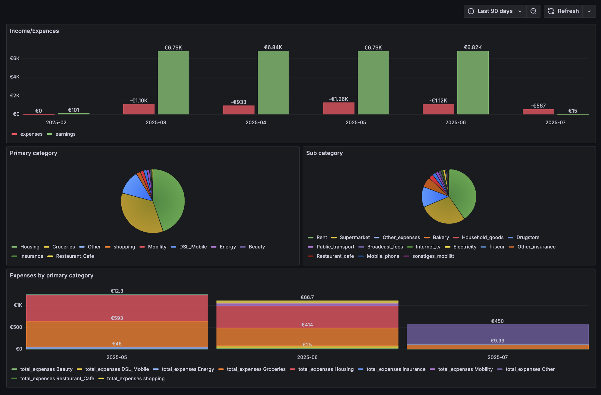

# c24-expences

## Overview

`c24-expences` is a project designed to manage and analyze expenses
using ClickHouse and Grafana. This project includes various components
such as data processing, storage, and visualization.



## Table of Contents

- [Overview](#overview)
- [Components](#components)
- [How to use](#how-to-use)
- [Configuration](#configuration)
- [C24 CSV export](#c24-csv-export)
- [Parser management](#parser-management)

## Components

- **ClickHouse**: Used for storing transaction data.
- **Grafana**: Used for visualizing the data stored in ClickHouse. Dashbords and
    data source settings are store in the [grafana](./grafana/provisioning/)
    directory.
    It's necessary to install the [Grafana ClickHouse plugin](https://grafana.com/grafana/plugins/vertamedia-clickhouse-datasource/). Plugin's data must be stored in the
    [dist/grafana-clickhouse-datasource](./dist/grafana-clickhouse-datasource)
    directory.
- **Golang**: Used for processing and analyzing the data.
  - `pkg/c24parser` contains the main logic for parsing and processing
    transaction data. Also contains mapping german words to english.
- **Docker**: Used for containerizing the application and its dependencies.

## How to use

You can use the next `make` commands to build and run the project:

```makefile
# make
Usage:
  help           prints this help message
  fmt            format the code
  lint           run linters
  build          test compile the binary for the local machine
  setup          install dependencies and setup the project
  test           run tests with coverage
  run            runs docker-compose with the project
  stop           stops docker-compose with the project
  build-docker   builds the docker image
```

## Configuration

Configuration is managed through `yaml` file.

The example configuration file is located in the
[`config.yaml`](./config.yaml).

## C24 CSV export

C24 provides a CSV export of transactions, documentation can be found
[by the next link](https://hilfe.c24.de/hc/de/articles/8082169487250-Wie-kann-ich-meine-Transaktionen-exportieren).

Example of the CSV file: [transaction.csv.mock](./testdata/transaction.csv.mock).

After downloading the CSV file, you need to save it to the `./input/` directory.
Then edit volumes of the `c24-parse` container in the`docker-compose.yaml` and
uncomment the string `#- ./input:/input`.

After that, you can run the project with the `make run` command. The
`c24-parse` container will parse the CSV file and store the data in the
ClickHouse database. The parsed data will be shown in the Grafana dashboard by
the link [http://localhost:3000](http://localhost:3000).

## Parser management

At the moment, there are no oportunities to manage the parser settings and
categories mapping via the UI or config files.

To change the parser settings, you need to edit the code in the
[`pkg/c24parser/categoriser.go`](./pkg/c24parser/categoriser.go) file.

This logic will be refactored in the future to allow for easier management of
the parser settings and categories mapping.
